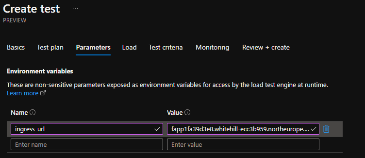
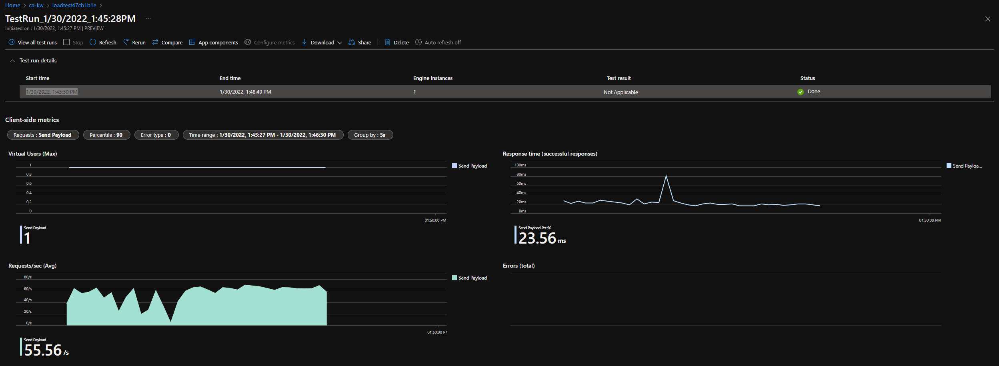
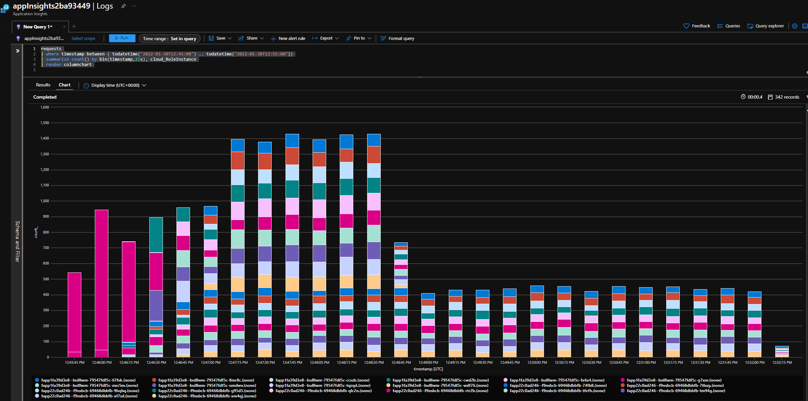

# container-apps-experimental

Try container apps with various workloads

- .NET core 3.1 based Dapr applications
- .NET 6.0 / Functions v4 applications

> hence `.devcontainer` is configured to do a primary .NET Core 3.1 SDK and a secondary .NET 6.0 SDK install

## get started / preparations

sign in with Azure CLI

```shell
az login --use-device-code
```

switch to the desired subscription

```shell
az account set -s "{subscription-name-or-id}"
```

[re-register Microsoft.Web](https://github.com/microsoft/azure-container-apps/wiki/Known-Issues-for-public-preview)

```shell
az provider register --namespace Microsoft.Web
```

sign in with Pulumi

```shell
pulumi login
```

## test Functions scaling

- change `ca-pulumi-dotnet/Program.cs` to `FunctionAppStack.cs`.
- deploy

```shell
cd ca-pulumi-dotnet
pulumi stack init dev
pulumi up
```

- go to load testing resource in Azure Portal
- create test
- upload `ca-pulumi-dotnet/loadtest.jmx`
- in parameters set `ingress_url` to `urlfapp1` output value
- **Create** the test



**Result:**





## test ca-dotnet Dapr samples

deploy sample

```shell
cd app1
dotnet publish
cd ..
cd app2
dotnet publish
cd ..
cd ca-dotnet
pulumi up
```

test sample

```shell
pulumi stack select dev
curl $(pulumi stack output urlapp2)/health
curl $(pulumi stack output urlapp1)/health
curl -v $(pulumi stack output urlapp1)/healthapp2
```

> the first 2 test individual health endpoints, and the 3rd tests service invocation from app1 to app2

## to do

- [ ] [VNET integration](https://github.com/microsoft/azure-container-apps-preview/blob/main/docs/vnet.md)

## links

- [Container Apps Quickstart](https://github.com/microsoft/azure-container-apps-preview/blob/main/docs/quickstart.md#quickstart-deploy-a-simple-http-application)
- [VSCode devcontainer setup](https://stackoverflow.com/questions/69870435/how-do-i-add-pulumi-to-my-vscode-net-devcontainer)
- [other vscode-dev-containers features](https://github.com/microsoft/vscode-dev-containers/tree/main/script-library/docs)